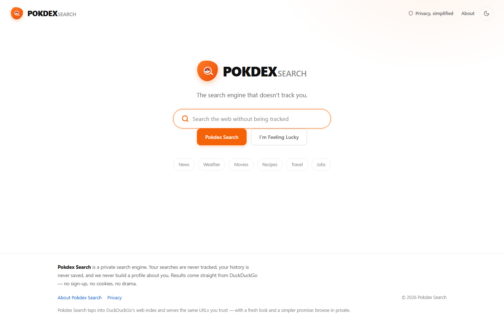
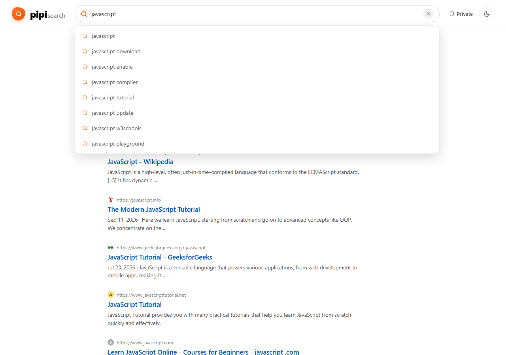

# pipi search

A private search engine — a DuckDuckGo-inspired homepage with a fresh **pipi** logo, no tracking, no saved history, and real web results pulled from DuckDuckGo's index.

🌐 **Live site:** https://pipisearch.netlify.app



## Features

- **Private by default** — no trackers, no saved search history, no ad profiles. Searches surface in the URL only.
- **Live web results** — results come straight from DuckDuckGo's HTML/Lite endpoints, with a Bing fallback if DuckDuckGo rate-limits the server.
- **Search suggestions** — DuckDuckGo-powered autocomplete as you type.
- **DuckDuckGo look & feel** — pill search bar, "Pipi Search" / "I'm Feeling Lucky" buttons, favicons, snippets, and pagination.
- **Light & dark themes** — remembers your choice, respects system preference.
- **I'm Feeling Lucky** — jumps straight to the first result.
- **Shareable URLs** — `/?q=javascript` deep-links a search; browser back/forward works.



## How it works

The browser can't call DuckDuckGo directly (CORS), so a small server-side proxy handles it:

1. The SPA calls `/api/search?q=...` (or `/api/suggest?q=...`).
2. In dev, a Vite middleware serves those routes (`vite.config.ts`).
3. In production, Netlify Functions serve them (`netlify/functions/search.mjs`).
4. The proxy scrapes DuckDuckGo's HTML results first, falls back to DDG Lite, then Bing if needed.

The `/api/*` routes are exposed to the same function via Netlify Functions v2 `config.path`.

## Tech Stack

| Layer | Technology |
|-------|-----------|
| Frontend | React 18, TypeScript, Vite |
| Icons | Lucide React |
| Search proxy | Netlify Functions (Node) with URL scraping |
| Styling | Plain CSS with CSS variables (light/dark theming) |
| Deployment | Netlify (static SPA + functions) |

## Getting Started

```bash
# Clone
git clone https://github.com/shafiathusssain-cell/pipi-search.git
cd pipi-search

# Install dependencies
npm install

# Start the dev server (includes the /api proxy middleware)
npm run dev
```

Open `http://localhost:5173` in your browser and search away.

## Building & Deploying

```bash
npm run build          # Output in dist/
npx netlify deploy --dir dist --prod
```

The Netlify Functions in `netlify/functions` are auto-detected. The SPA fallback in `netlify.toml` keeps `/?q=...` deep links working.

## Project Structure

```
├── netlify/
│   └── functions/
│       ├── ddg.mjs            # Shared scrapers (DuckDuckGo HTML, Lite, Bing, autocomplete)
│       └── search.mjs         # Netlify Function handler for /api/search + /api/suggest
├── public/                    # Static assets (favicon, robots, sitemap, pass-through SW)
├── src/
│   ├── components/
│   │   └── SearchField.tsx    # Search input with live autocomplete dropdown
│   ├── lib/
│   │   └── api.ts             # Fetch helpers for /api/search + /api/suggest
│   ├── App.tsx                # Home + results views, theming, history
│   ├── index.css              # DDG-style theme (light/dark via CSS variables)
│   └── main.tsx               # Entry point + service worker registration
├── assets/screenshots/        # README screenshots
├── netlify.toml
└── package.json
```

## License

MIT